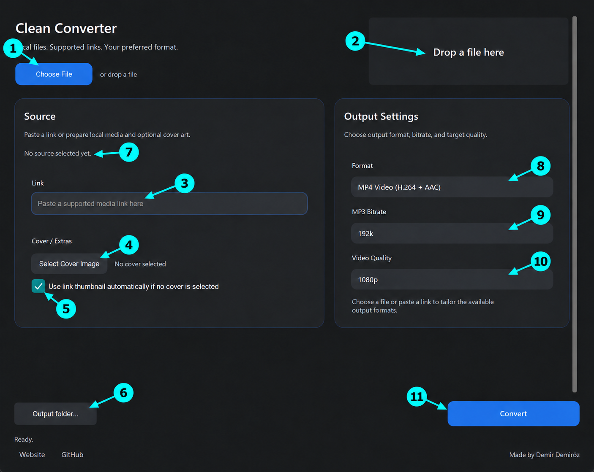
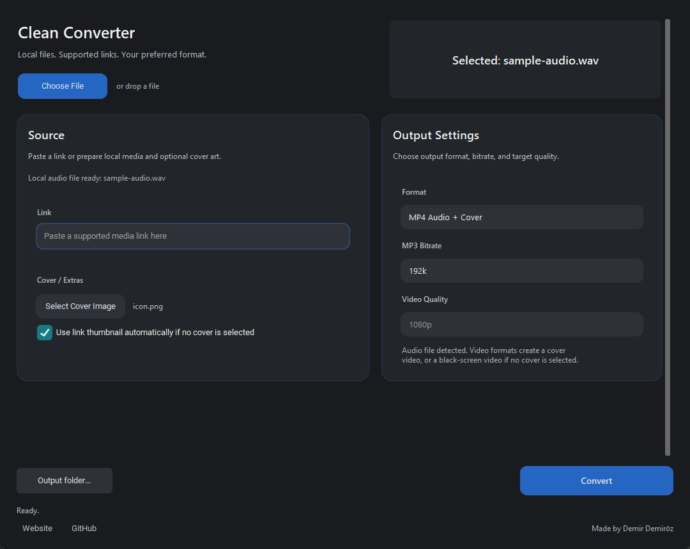
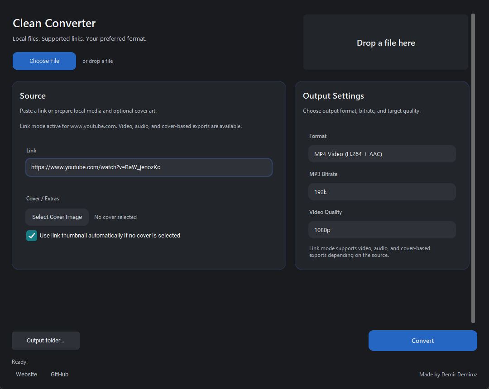

# 🎬 CLEAN CONVERTER

[English](README.md) · [demirdemiroz.com](https://demirdemiroz.com) · [GitHub](https://github.com/DDemiroz)

**Ses ve videoları yerel olarak dönüştürün, videodan ses çıkarın, kapaklı video oluşturun veya desteklenen bağlantılardan indirin—hepsi tek bir Windows uygulamasında.** Yerel dönüşüm internetsiz çalışır.

> ## 📦 Uygulamayı kullanmak mı istiyorsunuz?
>
> İlk paket yayımlandığında [GitHub Releases](https://github.com/DDemiroz/CLEAN-CONVERTER/releases) bölümündeki **`CleanConverterSetup.exe`** dosyasını indirip kurun. Python, FFmpeg ve gerekli diğer araçlar pakete dahildir. **Code → Download ZIP kaynak kodu içerir; kurulum dosyası değildir.**

**1.0.0 — yayın öncesi.** Kaynak kod bu depoda bulunuyor; kurulum paketi henüz yayımlanmadı.


## 🧭 Buradan başlayın

[Hızlı başlangıç](#quick-start) · [Kurulum](#installation) · [Kontroller](#controls) · [Girdiler](#inputs) · [Yerel kullanım](#local) · [Bağlantılar](#links) · [Çıktı formatları](#formats) · [Ayarlar ve dosyalar](#settings) · [SSS](#faq) · [Hatalar](#errors) · [Hata bildirimi](#report) · [Doğrulama](#verification) · [Geliştiriciler](#developers) · [Lisans](#license)

<a id="quick-start"></a>

## ⚡ Hızlı başlangıç

İlk yerel dönüşüm için: **Choose File → Format → Output folder → Convert → Done**. Link alanını boş bırakın. Önce kısa, özel bilgi içermeyen bir örnek deneyin; videodan ses çıkarmak için kaynakta ses bulunmalıdır. Ayrıntılı adımlar aşağıdadır.

<a id="installation"></a>

## 📦 Kurulum: kullanıcı için tek paket

Yayımlandığında GitHub **Releases** bölümündeki **CleanConverterSetup.exe** dosyasını indirin ve çalıştırın. **Code → Download ZIP**, kurulum paketi değil kaynak koddur.

Kurulum paketi Python çalışma ortamını, **FFmpeg, ffprobe, Deno ve yt-dlp** bileşenlerini birlikte içerir. Kullanıcının bunları ayrı indirmesi, komut çalıştırması veya PATH ayarlaması gerekmez. Kaynak deposunda büyük araç dosyalarının bulunmaması kurulumdan çıkarıldıkları anlamına gelmez. Yeni sürümün paket içeriği yayın öncesi ayrıca doğrulanacaktır.

1. Kurulum sihirbazını tamamlayın; isterseniz masaüstü kısayolunu seçin.
2. Uygulamayı açın ve ilk açılışta çıktı klasörünü seçin.
3. Dosyanızı seçip formatı belirleyin, **Convert** ile başlayın.
4. **Done** mesajını gördüğünüzde dosyanız hazırdır.

Mevcut eski paket imzasızdır. Yayımlanacak dosyanın kaynağını ve SHA-256 özetini kontrol edin.

Mevcut geliştirme/derleme hedefi **Windows x64**; desteklenen en eski Windows sürümü doğrulanmadı. macOS/Linux kurulum paketi sunulmuyor. İnternet indirme için gerekir, yerel dönüşüm için gerekmez. Kaynak indirme, geçici işlemler ve son çıktı için boş disk alanı bırakın; gereken alan medyaya göre değişir.

İlk çıktı klasörü seçimini iptal etmek uygulamayı kapatır. Sonradan değiştirmek için işlem yokken **Output folder…** kullanın. Kurulu kopyayı Windows Yüklü uygulamalar bölümünden kaldırabilirsiniz; kaldırma betiği kullanıcı ayarlarını korur ve kurulum klasörü dışındaki medya dosyalarını hedeflemez. Medyayı kurulum klasörü dışında tutun. Temiz Windows kaldırma doğrulaması henüz yapılmadı.

<a id="controls"></a>

## Ekrandaki kontroller



Numaralar açıklama içindir; uygulamanın gerçek arayüzünde görünmez.

Ekran görüntüleri alttaki **Questions or report any bugs → demirdemiroz.com** bölümü eklenmeden önce alındı. Bağlantı aşağıda açıklanmıştır; mevcut görseller korunmuştur.

| No | Alan / düğme | Ne işe yarar? |
|---|---|---|
| 1 | **Choose File** | Bilgisayarınızdaki tek ses veya video dosyasını seçer. Bağlantı alanını temizler. |
| 2 | **Drop a file here** | Dosyayı buraya sürükleyerek seçebilirsiniz. Toplu kuyruk değildir; tek dosya kullanın. |
| 3 | **Link** | İnternetten işlemek istediğiniz desteklenen medya bağlantısını yapıştırın. Yerel dosya dönüştürürken boş bırakın; geçerli bağlantı varsa bağlantı işlenir. |
| 4 | **Select Cover Image** | JPG/JPEG/PNG kapak seçer. Yanında seçilen dosyanın adı görünür. Mevcut video görüntüsünü normal video dönüşümünde değiştirmez; ses→video veya kapaklı çıktı içindir. |
| 5 | **Use link thumbnail automatically…** | Elle kapak seçilmemişse bağlantının küçük resmini kapak olarak kullanmayı dener. Yerel sesin gömülü albüm kapağını otomatik çıkarmaz. Elle seçilen kapak önceliklidir. |
| 6 | **Output folder…** | Çıktı klasörünü değiştirir. Orijinal dosyanın konumunu değiştirmez. |
| 7 | **Source** özeti | Seçilen kaynağın ses, video veya bağlantı olduğunu gösterir. İşleme başlamadan kontrol edin. |
| 8 | **Output Settings → Format** | Üretilecek dosyanın formatını seçer. Menüde video formatları, MP4 Audio + Cover ve ses formatları bulunur. Dosya uzantısını elle değiştirmek yerine dönüşümü bu seçim yapar. |
| 9 | **MP3 Bitrate** | Yalnızca MP3 çıktısını etkiler: 192k, 256k veya 320k. Diğer formatların kalitesini değiştirmez. |
| 10 | **Video Quality** | Normal video çıktılarında yüksekliğin üst sınırını seçer. Ses çıktılarında ve MP4 Audio + Cover hazır ayarında devre dışıdır. |
| 11 | **Convert** | Seçilen kaynak ve ayarlarla işlemi başlatır. İşlem sırasında tekrar basılamaz. Sonucu sol alttaki durum satırından izleyin. |

**Durum satırı:** Ready hazır, indirme sırasında yüzde/hız/tahmini süre, dönüştürmede işlem bilgisi, Done tamamlandı anlamındadır. Birden fazla indirme akışı olduğunda yüzde yeniden başlayabilir; tek bir toplam yüzde değildir. Hata olursa ayrıntı penceresi açılır. **Website/GitHub** bağlantıları geliştirici sayfalarını tarayıcıda açar; sağ alt imza geliştiriciyi belirtir.

<a id="inputs"></a>

## Neleri dönüştürebilirim?

Dosya seçicideki yaygın girişler:

- **Video:** MP4, WebM, MKV, MOV, AVI, M4V.
- **Ses:** MP3, WAV, FLAC, OGG, M4A, AAC, Opus, WMA.
- **Kapak:** JPG, JPEG, PNG.

“All” seçeneği başka dosyalar seçmeye izin verir; bu, hepsinin desteklendiği anlamına gelmez. Gerçek destek dosyanın içindeki codec'e ve paketlenen FFmpeg'e bağlıdır. **PDF/Word/Excel dönüştürme, genel resim formatı dönüştürme ve arşiv açma bu uygulamanın işi değildir.** Her olası giriş/çıktı eşleşmesinin çalışacağı garanti edilmez.

| Girdi | Çıktı | Örnek |
|---|---|---|
| Video | Başka video formatı | MOV → MP4, MP4 → WebM, MKV → MP4 |
| Ses akışı olan video | Ses | MP4 → MP3, MOV → WAV, MKV → FLAC |
| Ses | Başka ses formatı | WAV → MP3, FLAC → M4A, WMA → WAV |
| Ses + kapak | Video | WAV + PNG → MP4 |
| Ses, kapaksız | Siyah arka planlı video | MP3 → MP4 veya WebM |
| Video + kapak | Kapak + videonun sesi | MP4 → MP4 Audio + Cover |
| Desteklenen bağlantı | Video, ses veya kapaklı çıktı | Bağlantı → MP4, MP3 veya MP4 Audio + Cover |

<a id="local"></a>

## Yerel dosyalar: adım adım

### 1. Videoyu başka video formatına çevirme

1. **Choose File (1)** ile videoyu seçin veya **(2)** alanına sürükleyin.
2. **Format (8)** içinden hedef video formatını seçin; örneğin MOV dosyası için **MP4 Video (H.264 + AAC)**.
3. **Video Quality (10)** seçin: 1080p üst sınır veya kaynak boyutunu sınırlamamak için Best.
4. **Output folder (6)** konumunu belirleyin, **Convert (11)** düğmesine basın.
5. Done mesajından sonra ilgili video klasörünü açın. Orijinal dosya yerinde kalır.

Uyumlu H.264/AAC kaynak MP4'e aktarılırken ve çözünürlük sınırını karşılıyorsa yeniden kodlama atlanabilir. Diğer durumlarda işlem daha uzun sürebilir. Best seçmek bütün dönüşümlerin kayıpsız olduğu anlamına gelmez.

### 2. Videodan yalnızca sesi çıkarma

1. Ses içeren bir video seçin.
2. Format olarak **MP3**, **WAV**, **FLAC**, **OGG**, **M4A** veya **AAC** seçin.
3. MP3 seçtiyseniz bitrate'i ayarlayın; kapak ve Video Quality bu çıktıyı etkilemez.
4. Convert'e basın. Örneğin MP4 videodan MP3 ürettiğinizde görüntü çıktıya dahil edilmez.

Videoda ses akışı yoksa ses üretilemez. Konuşmayı metne çevirme veya müzik/vokal ayırma yapılmaz.

### 3. Ses formatlarını birbirine dönüştürme

1. WAV, MP3, FLAC, M4A veya desteklenen başka bir ses dosyası seçin.
2. Hedef ses formatını seçin; örneğin **FLAC → M4A** veya **WAV → MP3**.
3. MP3 için 192k/256k/320k seçip Convert'e basın.
4. Ses formatının klasöründeki dosyayı kullanın.

MP3'ü FLAC/WAV yapmak daha önce kaybolan ayrıntıları geri getirmez; dosya büyüyebilir. Yüksek bitrate de düşük kaliteli kaynağı onarmaz.

### 4. Sese kapak ekleyerek video oluşturma



1. Ses dosyasını seçin.
2. **Select Cover Image (4)** ile JPG/PNG seçin.
3. **MP4 Audio + Cover** seçin ve Convert'e basın.
4. Çıktı, ses boyunca seçilen görseli gösteren MP4 olur.

Kapak merkezden kare kırpılır ve bu hazır ayarda 1080×1080'e ölçeklenir; küçük kapaklar büyütülebilir. Video Quality bu hazır ayarda kapalıdır. Normal **MP4 Video / WebM / MKV / MOV / AVI** seçerek de sesi videoya dönüştürebilir, bu kez Video Quality üst sınırını uygulayabilirsiniz. Mevcut video dosyasını **MP4 Audio + Cover** ile işlerseniz görüntü yerine kapak ve videonun sesi kullanılır.

### 5. Kapaksız sesi videoya çevirme

Ses dosyasını seçip kapak seçmeden normal video formatlarından birini seçin. Video Quality ile siyah arka planın boyutunu belirleyin ve Convert'e basın. Üretilen video 16:9 siyah görüntü ve ses içerir. Daha önce kapak seçtiyseniz kapaksız başlamak için uygulamayı yeniden açın; şu an ayrı “kapağı kaldır” düğmesi yoktur.

### 6. Videonun görüntüsünü kapakla değiştirme

1. Ses içeren videoyu seçin.
2. JPG/PNG kapak seçin.
3. Normal MP4 Video yerine **MP4 Audio + Cover** seçin.
4. Convert'e basın. Çıktı kaynak sesi kare kapakla kullanır; orijinal video değişmez.

Kapak seçmek normal video çıktısının görüntüsünü değiştirmez. Yerel gömülü albüm kapağı otomatik çıkarılmaz.

<a id="links"></a>

## Bağlantıdan indirme ve dönüştürme



1. Medya bağlantısını **Link (3)** alanına yapıştırın.
2. Video için bir video formatı ve kalite, yalnızca ses için bir ses formatı seçin.
3. Kapaklı indirme için **MP4 Audio + Cover** seçin; kendi kapağınızı kullanın veya **(5)** seçeneğini açık bırakın.
4. Convert'e basın; indirme ve gerekiyorsa dönüştürmenin tamamlanmasını bekleyin.
5. Kaydedilen dosya normal yerel dosyadır; internetsiz oynatılabilir.

Destek kaynak servise ve yt-dlp sürümüne bağlıdır; “her site” sözü verilmez. DRM, özel/erişimi kısıtlı içerik ve bazı oturum açma gerektiren bağlantılar desteklenmeyebilir. Yalnızca kaydetme hakkınız olan içerikleri kullanın. İşlemin kaynak alternatiflerini denemesi, otomatik olarak farklı bir videoya geçtiği anlamına gelmez.

<a id="formats"></a>

## Tüm çıktı formatları

**Container/dosya kabı** (MP4/MKV gibi) akışları taşır; **codec** (H.264/AAC gibi) içeriklerini kodlar. Dosya uzantısını değiştirmek bunları dönüştürmez. Dosya seçici yaygın girdileri listeler; bir dosya kabının içerebileceği her codec'i değil.

| Seçim | Üretilen dosya ve kullanım |
|---|---|
| **MP4 Video (H.264 + AAC)** | .mp4; yaygın video oynatıcılar için H.264 görüntü, varsa AAC ses. Genel kullanım için başlangıç seçimi. |
| **WEBM Video (VP9 + Opus)** | .webm; VP9 görüntü ve Opus ses. Web odaklı kullanım; kodlama daha yavaş olabilir. |
| **MKV Video (H.264 + AAC)** | .mkv; H.264/AAC içeren Matroska çıktı. Kaynağın bütün altyazı veya ek ses kanallarını koruyan arşivleme modu değildir. |
| **MOV Video (H.264 + AAC)** | .mov; H.264/AAC içeren MOV. ProRes veya kayıpsız kurgu çıktısı değildir. |
| **AVI Video (H.264 + AAC)** | .avi; H.264/AAC. Eski cihazlar bu codec/container birleşimini desteklemeyebilir. |
| **MP4 Audio + Cover** | .mp4; kare kapak veya kapak yoksa siyah görüntüyle ses videosu. Gömülü MP3 albüm kapağı ekleme değildir. |
| **MP3** | .mp3; seçilen 192/256/320 kbps ile kayıplı ses. |
| **WAV** | .wav; 44,1 kHz ses çıktısı. Genellikle büyük dosya; kaynakta olmayan kaliteyi geri getirmez. |
| **FLAC** | .flac; kayıpsız ses kodlaması. Kayıplı kaynaktan gelen kayıpları geri alamaz. |
| **OGG** | .ogg; Vorbis ses, sabit uygulama kalite ayarı. MP3 Bitrate alanından etkilenmez. |
| **M4A** | .m4a; AAC ses, 192 kbps. |
| **AAC** | .aac; AAC ses, 192 kbps. M4A ile dosya kabı/uzantısı farklıdır. |

<a id="settings"></a>

## Kalite, dosyalar ve ayarlar

### Kaynak önceliği ve saklama

Geçerli Link, seçili yerel dosyadan önceliklidir. Yerel dosya seçmek/sürüklemek Link alanını temizler. Elle seçilen ve var olan kapak, bağlantı küçük resminden önceliklidir; otomatik kapağı kapatmak elle seçilmiş kapağı kaldırmaz. Kaynak, kapak, format ve kalite iş başında sabitlenir.

Varsayılan format düzeninde alt klasörler **MP4_VIDEO, WEBM_VIDEO, MKV_VIDEO, MOV_VIDEO, AVI_VIDEO, MP4_COVER, MP3, WAV, FLAC, OGG, M4A, AAC** olur. Örneğin sample.mp4 varsa sample (2).mp4 adı kullanılır. Dosya adları Windows için temizlenir; sabit azami yol uzunluğu desteği vaat edilmez.

Geçici indirme/kapak dosyaları seçilen çıktı konumunda uygulamaya ait ayrı klasör kullanır. Dönüşüm tamamlanmadan önce geçici dosyada çalışır ve son adı işlem boyunca ayırır. Normal temizlik yalnızca sahip olunan çalışma dosyalarını hedefler; çökme veya kilitli dosyalar artık bırakabilir. Ayrılmış dosyayı **Done** görünmeden tamamlanmış saymayın. Orijinallerin üzerine bilerek yazılmaz.

Ayarlar genel Windows konumu `%APPDATA%\Clean Converter\config.json` içinde tutulur (APPDATA yoksa kullanıcı ana klasörüne döner). Bu, belirli bir kullanıcıya ait örnek yol değildir. Format, bitrate ve çıktı klasörü korunur; iş seçimini kaydetse de video kalitesi açılışta 1080p'ye döner. Kaynak/kapak seçimleri geri yüklenmez. Klasör düzenleme varsayılan açık olup arayüzde anahtarı yoktur. Geçersiz ayarlar varsayılanlara dönebilir; uygulama çalışırken ayar dosyasını değiştirmeyin.

- **Best:** normal kaynak videoya yükseklik sınırı koymaz; yeniden kodlama yine gerekebilir.
- **2160p (4K), 1440p (2K), 1080p, 720p, 480p, 360p:** video yüksekliğinin üst sınırıdır. En-boy oranı korunur; her çıktı 16:9 olmak zorunda değildir. 720p kaynak 1080p seçilince 1080p ayrıntı kazanmaz.
- **MP3 Bitrate:** 192k daha küçük, 320k genellikle daha büyük çıktı üretir; 256k ara seçenektir. Kaynak kalitesi sınırı geçerlidir.
- Çıktılar seçilen ana klasörün MP4_VIDEO, WEBM_VIDEO, MP4_COVER, MP3 gibi format alt klasörlerinde tutulur. Aynı ad varsa numaralı yeni ad kullanılır; var olan dosyanın üzerine yazılmaz.
- İşlem başında seçilen ayarlar o iş için sabitlenir. Sonradan değiştirdiğiniz format/kalite aktif işi değiştirmez.
- Format, MP3 bitrate ve çıktı klasörü kaydedilir. Yeni oturumun video kalitesi 1080p olur; kaynak dosya ve kapak yeniden seçilir.
- Aynı anda tek işlem vardır. Toplu kuyruk, kırpma, birleştirme, altyazı düzenleme ve uygulama içi iptal yoktur. Normal kapatma işlem bitene kadar engellenir.
- Uzun işler süre, codec, kalite ve bilgisayar hızına göre değişir. Dönüşüm başarısızsa hata ayrıntısını inceleyin; ses akışı olmayan kaynak, bozuk dosya veya dolu/erişilemeyen çıktı diski neden olabilir.
- Yerel dönüştürme internetsiz çalışır. Kaynak indirme ve bağlantı küçük resmi internet gerektirir.
- Telemetri/hesap sistemi eklenmemiştir. Ayarlar kullanıcı uygulama-verisi klasöründe saklanır. Hata bildirirken kişisel yolları, özel URL'leri ve hesap bilgilerini silin.

<a id="faq"></a>

## Sık sorulan sorular

**1080p kesin 1920×1080 demek mi?** Hayır. Normal video için en fazla yükseklik sınırıdır. Küçük kaynak küçük kalır; dikey veya 16:9 olmayan videonun genişliği farklıdır. Bağlantıda servisin sunduğu akışlar da belirleyicidir. Çözünürlüğü menüden varsaymak yerine oluşan dosyanın özelliklerinden kontrol edin.

**Best kayıpsız mı? 320k kötü kaydı iyileştirir mi?** Hayır. Best normal videonun yükseklik sınırını kaldırır, kodlama kayıplarını değil. Daha yüksek MP3 bitrate kaynakta bulunan bilgiyi korumaya yardımcı olabilir; kayıp ayrıntıyı geri getirmez. Tekrarlı kayıplı dönüşümler kaliteyi azaltabilir.

**Dosya neden büyüdü veya işlem neden yavaş?** Süre, codec, çözünürlük ve kodlama ayarları etkilidir. WAV veya zaten sıkıştırılmış dosyanın yeniden kodlanması boyutu artırabilir. Video/VP9 kodlaması ses dönüşümünden veya uyumlu MP4 akış kopyalamadan uzun sürebilir. Sabit bitiş süresi veya donanım hızlandırma kontrolü sunulmaz.

**İnternetsiz izleyebilir miyim?** Evet; başarıyla kaydedilmiş yerel dosya uyumlu oynatıcıda, siteye girmeden açılır. Bu, yayın servisinin kendi çevrimdışı özelliğinden farklıdır. Yerel dönüşüm internetsizdir; bağlantılar ve çevrimiçi küçük resimler internet ister.

**Kapak neden kırpıldı veya video neden siyah?** Kapak ön işlemesi merkezden kare kırpar ve dışa aktarmadan önce 1080×1080'e ölçekler. Önemli içerikleri kenarda olmayan kare görsel kullanın. Kapaksız ses siyah video üretir. Normal bağlantı→video alternatifinde isteğe bağlı küçük resim alınamazsa da siyah kullanılabilir. MP4 Audio + Cover için gerekli otomatik kapak alınamazsa işlem durur; kendi görselinizi seçin veya otomatik kapağı kapatın.

**Bazı ayarlar neden kapalı?** MP3 Bitrate yalnızca MP3 içindir. Video Quality ses çıktısına veya sabit kapak hazır ayarına uygulanmaz. Format menüsü algılanan kaynağa göre gruplandırılır. İş sırasında Convert devre dışıdır; başka kaynak, kapak veya çıktı klasörü seçimi iş bitene kadar engellenir.

**İptal edebilir, dosyaları kuyruğa koyabilir veya işlem sürerken kapatabilir miyim?** Uygulama içi iptal ve toplu kuyruk yoktur. Normal kapatma beklemenizi ister. Zorla kapatma/elektrik kesintisi desteklenen iptal yöntemi değildir; geçici veya ayrılmış çıktı dosyaları bırakabilir. Başka örnek çalışırken dosyalarını silmeyin.

**Bütün akış ve etiketler korunur mu?** Altyazı, bölüm, HDR, metaveri, birden fazla ses kanalı veya her codec için koruma garantisi yoktur; bunları düzenleyen kontroller bulunmaz. Bir koleksiyonu dönüştürmeden önce kısa çıktıyı ihtiyaçlarınıza göre inceleyin. DRM kaldırma, oturum/çerez içe aktarma, konuşmayı metne çevirme, resim formatı ve belge dönüştürme özellikleri yoktur.

<a id="errors"></a>

## Hata ve uyarı rehberi

Yalnızca pencere başlığına değil mesajın kendisine bakın. Arayüzde İngilizce mesajlarla Türkçe indirme açıklamaları birlikte bulunur; aşağıdaki ayırt edici özgün ifadeler iki README'de de aranabilir. Değişken yollar, URL'ler ve teknik ayrıntılar örneklerde özellikle yer almıyor.

### Başlangıç, dosyalar ve dönüştürme

| Mesaj veya ayırt edici parça | Kısa anlamı | Olası neden | Ne deneyebilirsiniz? |
|---|---|---|---|
| Missing tools / FFmpeg not found | Gerekli medya araçları eksik; açılış durur. | ffmpeg.exe veya ffprobe.exe yok, paket eksik. | Doğrulanmış tam paketi yeniden kurun; kaynak kullanıcıları tools/ konumunu kontrol etsin. Güvenlik yazılımını kapatmayın. |
| Config Warning / Output folder was selected, but settings could not be saved yet | Klasör seçildi fakat ayarlar kaydedilmedi. | Ayar klasörü izni veya disk sorunu. | Uygulama-verisi klasörüne erişimi ve disk alanını kontrol edin; ayarlar yeniden açılışta korunmayabilir. |
| Config Error / Settings could not be saved | Ayarlar kaydedilemediğinden işlem başlamadı. | Ayar konumu erişilemez veya yazılamaz. | Disk/erişim sorununu giderip tekrar deneyin; sadece çıktı klasörünü değiştirmek ayar klasörünü düzeltmeyebilir. |
| Output folder is missing | Çıktı konumu seçili değil. | Eksik/geçersiz ayar. | İşlem yokken Output folder… seçin. |
| Output folder is not writable | Seçilen konuma yazılamıyor. | İzin, bağlantısı kesilmiş disk veya dolu alan. | Erişilebilir ve boş alanı olan klasör seçin. |
| Output folder (pencere başlığı) | Klasör değiştirme başarısız. | Klasör oluşturma, yazma kontrolü veya ayar kaydetme hatası. | Ayrıntıyı okuyun; önceki çıktı klasörü ayarı geri yüklenir. |
| Missing input / Select/drag a file or paste a link | Kullanılabilir girdi seçilmedi. | Boş seçim, bulunamayan yerel dosya veya tanınmayan bağlantı. | Var olan medya dosyası veya desteklenen URL seçin. |
| Conversion running / Please wait for the current operation to finish before closing | İşlem sırasında kapatma engelleniyor. | Aktif iş var; bilgilendirmedir. | Tamamlanmasını bekleyin; uygulama içi iptal yoktur. |
| Error / Failed. Check the error details. | Mevcut işlem başarısız. | Özel hatayı saran genel başlık/mesaj. | Teknik ayrıntıyı okuyup aşağıdaki ilgili açıklamaya bakın. |
| Conversion failed / Postprocessing: Conversion failed | Dönüştürme veya indirme sonrası işleme başarısız. | Codec/girdi/çıktı/araç sorunu; tek başına son satır nedeni söylemez. | Önceki ayrıntı satırlarını inceleyin, sağlam kısa yerel örnek deneyin ve disk alanına bakın. Tekrarlanırsa temizlenmiş ayrıntıyı bildirin. |
| Conversion produced an empty file | Araç kullanılabilir çıktı üretmedi. | Geçersiz kaynak veya işleme sorunu. | Kaynağın açıldığını doğrulayın; başka desteklenen format deneyin, sürerse bildirin. |
| No downloaded video file was found in temp. | Beklenen indirilen video bulunamadı. | Yarım indirme veya indiricinin beklenmeyen çıktısı. | Erişim ve disk alanını kontrol ederek bir kez tekrar deneyin; tekrarlanıyorsa bildirin. |
| No downloaded audio file was found in temp. | Beklenen indirilen ses bulunamadı. | Ses indirme/son işleme beklenen dosyayı üretmedi. | Önceki ayrıntıya bakın; desteklenen kaynağı tekrar deneyin, tekrarlanırsa bildirin. |
| Report a bug / Open … in your browser to report the issue. | Tarayıcı otomatik açılamadı. | Tarayıcı ilişkilendirmesi yok veya başlatma hatası. | https://demirdemiroz.com/iletisim/ adresini elle açın. Otomatik bildirim gönderilmedi. |

### Desteklenen bağlantılardan indirme

| Mesaj veya ayırt edici parça | Kısa anlamı | Olası neden | Ne deneyebilirsiniz? |
|---|---|---|---|
| YouTube bu istegi bot kontrolune takti / confirm you're not a bot | Ek doğrulama isteniyor. | Servisin otomasyon kontrolü. | Bekleyip sonra deneyin; normal tarayıcı erişimini kontrol edin. Uygulamada doğrulama/oturum açma akışı yoktur. |
| Bu video private durumda / private video | Özel içerik alınamıyor. | Erişim sınırlı. | Kaydetme yetkiniz olan içeriği desteklenen erişim yoluyla kullanın. |
| Bu video giris gerektiriyor / login required / sign in | Oturum veya başka erişim koşulu gerekiyor. | Hesap, yaş veya bölge koşulu; ifade tek başına nedeni kanıtlamaz. | Kaynağın erişilebilirliğini kontrol edin; uygulamada hesap/çerez içe aktarma yoktur. |
| Video kullanilamiyor / video unavailable | Kaynak erişilebilir değil. | Kaldırılmış, gizli, bölge kısıtlı veya geçici olarak kullanılamayan medya. | Özgün URL'yi tarayıcıda kontrol edin; gerekirse erişilebilir, yetkili başka kaynak kullanın. |
| Bu link desteklenmiyor / Unsupported URL | İndirici bu URL'yi işleyemiyor. | Desteklenmeyen site veya sayfa türü. | Desteklenen doğrudan medya sayfası URL'sini kullanın; her site desteklenmez. |
| uygun format bulunamadi / Requested format is not available / No video formats found | Uygun akış bulunamadı. | Sunulan akışlar, seçilen yükseklik veya çıkarma sorunu. | Daha büyük dosya uygunsa Best dahil başka kalite deneyin; normalde var olan format alınamıyorsa bildirin. |
| Sunucu erisimi reddetti (403) / HTTP Error 403 / Forbidden | Sunucu medya isteğini reddetti. | Servis kısıtı, süresi dolan akış URL'si, istemci/çıkarıcı veya başka erişim sorunu. | Sonra tekrar deneyin, doğrulanmış güncel uygulama yayını olup olmadığına bakın. Bu mesaj uygulamanın hatasız olduğunu kanıtlamaz. |
| Cok fazla istek algilandi (429) / Too Many Requests | İstek sıklığı sınırlandı. | Bağlantıdan çok fazla istek gönderilmiş olabilir. | Tekrarlı denemeleri durdurup bekleyin. |
| Video indirilemedi / Unknown yt-dlp error | Daha özel açıklamayla eşleştirilemeyen indirme hatası. | Ağ, çıkarma veya servis hatası. | Teknik ayrıntıyı okuyun; kaynak erişimi ve ağı kontrol edin, tekrarlanıyorsa bildirin. |

### Kapak ve küçük resimler

| Mesaj veya ayırt edici parça | Kısa anlamı | Olası neden | Ne deneyebilirsiniz? |
|---|---|---|---|
| Cover Error | Kapak ön işlemesi başarısız. | Okunamayan/bozuk görsel veya FFmpeg hatası. | Normal açılan geçerli JPG/PNG deneyin; ayrıntıya bakın. Ardından genel Error penceresi de gelebilir. |
| No thumbnail URL found for this video. | Kullanılabilir küçük resim adresi sunulmadı. | Küçük resim metaverisi eksik. | Elle kapak seçin veya siyah çıktı uygunsa otomatik kapağı kapatın. |
| Auto thumbnail could not be used. | Gerekli otomatik kapak hazırlanamadı. | Küçük resim indirme veya görsel işleme hatası. | Elle kapak seçin veya otomatik kapağı kapatıp tekrar deneyin. |

### Her zaman hata anlamına gelmeyen durum mesajları

| Durum | Anlamı ve yapılacak işlem |
|---|---|
| Ready; Input file; Link detected; Cover selected; Output folder updated | Hazır veya seçim onaylandı. Kaynağı/ayarları kontrol edip başlayın. |
| Auto thumbnail enabled / disabled | Tercih değişti. Elle seçilen kapak yine önceliklidir. |
| Preparing download source / Preparing audio source | Aynı URL için akış alternatifi hazırlanıyor. |
| Download source … failed. Trying another source… / Audio source … failed. Trying another source… | Bir alternatif başarısız; otomatik denemeler sürüyor. Sonucu bekleyin. |
| All download sources failed. Showing error… | Alternatifler tükendi; ardından gelen hata penceresine bakın. |
| Downloading video / Downloading audio (temp); yüzde, hız ve ETA | İndirme sürüyor; son aşama olmak zorunda değil. Ayrı akışlar/denemeler yüzdeyi yeniden başlatabilir. |
| … finished. Preparing file… | Bir indirme aşaması bitti; birleştirme/dönüştürme sürebilir. |
| Fetching thumbnail / Processing cover image | Kapak hazırlanıyor; son medya çıktısı henüz hazır değil. |
| Auto thumbnail could not be fetched. Using black background. | İsteğe bağlı kapak alınamadı; bu işlem yolu siyah video ile devam eder. |
| Encoding MP4/WEBM/MKV/MOV/AVI; Creating MP4 (cover + audio); Converting audio; time=… | FFmpeg çalışıyor. Source resolution kaynak boyutudur; son çıktı çözünürlüğünün kanıtı değildir. |
| Done: … | İş tamamlandı; sonucu çıktı klasöründe bulun. |
| Need help? … demirdemiroz.com | İşlem hatalarına eklenen yardım metni; ayrı hata değildir. |

### Değişken teknik ayrıntılar

FFmpeg, yt-dlp ve Windows yukarıdaki sabit uygulama metinlerinden farklı birçok mesaj üretebilir. Aşağıdakiler **örnek hata aileleridir; eksiksiz liste veya kesin teşhis değildir**:

| Teknik ifade örneği | Kısa anlam / olası neden | Sonraki adım |
|---|---|---|
| Permission denied / Access is denied | Dosya/klasöre erişilemiyor; izin veya dosya kilidi olabilir. | Dosyayı tutan programı kapatın; erişilebilir çıktı klasörü seçin. |
| No space left on device / disk full | Geçici/son medya için yer yok. | Alan açın veya başka disk seçin. |
| No such file or directory / cannot find the file | Kaynak/araç/klasör taşınmış, kaybolmuş veya erişilemiyor. | Kaynağı tekrar seçip yolu/diski kontrol edin. |
| Invalid data found / moov atom not found | Medya eksik, bozuk veya beklenen formatta değil. | Kaynağı oynatmayı deneyin ve geçerli, yetkili kopya edinin; uzantı değiştirmek onarım değildir. |
| matches no streams / does not contain any stream | Gerekli ses/video akışı bulunamadı. | Seçilen çıktı için gereken akışın kaynakta olduğunu doğrulayın. |
| Unknown encoder / codec veya muxer hataları | İstenen kodlama/container kullanılamıyor veya uyumsuz. | Başka çıktı formatı deneyin; desteklenen tam araç paketini doğrulayın. |
| timed out / connection reset / name resolution | Ağ işlemi başarısız. | Bağlantıyı ve servis erişimini kontrol edip sonra deneyin. |
| File exists | Hedef ad, başka uygulama örneği tarafından ayrılmış olabilir. | Diğer iş bitince tekrar deneyin; var olan dosyaların üzerine yazılmaz. |

Hatayı çözmek için korumaları kapatmayın veya kimlik bilgisi/çerez paylaşmayın. Bildirmeden önce kişisel yolları, özel URL'leri, hesap bilgilerini ve ilgisiz ekran içeriğini çıkarın. Hata kodu tek başına nedenin uygulama, kaynak, servis veya ortam olduğunu belirlemez.

<a id="report"></a>

## Hata bildirimi

Uygulamanın altındaki **Questions or report any bugs →** metninin yanındaki **demirdemiroz.com** bağlantısı doğrudan [iletişim sayfasını](https://demirdemiroz.com/iletisim/) açar. İşlem hataları da bu bağlantıyı hatırlatır. Uygulama hata kaydı, dosya, yol veya bağlantıyı otomatik göndermez. Bildiriminize uygulama sürümünü, seçilen formatı ve tekrar üretme adımlarını ekleyin; ekran görüntülerinden ve hata ayrıntılarından kişisel bilgileri çıkarın. Tarayıcı açılamazsa elle açabileceğiniz adres gösterilir.

Şablonu mesajınıza kopyalayın; uygun ve özellikle gerekli olmadıkça özel kaynak bağlantısı veya orijinal medya eklemeyin:

```text
Uygulama sürümü:
Windows sürümü:
Kaynaktan mı, kurulu EXE'den mi çalışıyor:
Kaynak: yerel dosya / desteklenen bağlantı (yalnızca servis adı)
Girdi medya türü:
Çıktı formatı / video kalitesi / MP3 bitrate:
Elle seçilmiş kapak veya otomatik küçük resim:
Tekrar üretme adımları:
Beklenen sonuç:
Gerçekleşen sonuç:
Kişisel bilgiler temizlenmiş hata özeti ve ilgili teknik satırlar:
İsteğe bağlı ekran görüntüsü (kişisel bilgiler çıkarılmış):
```

Site yalnızca düğmeye tıklayınca açılır; hata tarayıcıyı otomatik açmaz. Çevrimiçi kaynak servisleri indirme isteklerini yine alır; siteyi ziyaret etmek tarayıcınızı normal şekilde kullanır. Bu, anonim bildirim garantisi değildir.

<a id="verification"></a>

## Doğrulama ve yayın hazırlığı

**Kayıtlı kaynak kontrolü — 2026-10-03: 68 test geçti.** 740×540 ve 1080×860 pencerede gerçek alt satır hizalama kontrolleri dahildir. Tarihli bir test sonucudur; hiç hata olmadığı anlamına gelmez.

| Alan | Kanıt / kalan iş |
|---|---|
| Kaynak testleri | Ayar türleri, dosya adı işleme, ayrı geçici çalışma, hatalı çıktı temizliği, var olan çıktının korunması, yükseklik sınırlı alternatifler, işlemde kapatma, klasör geri dönüşü ve hata bildirme tarayıcı/yedek davranışı kapsanır. |
| Gerçek FFmpeg kontrolleri | Kısa üretilmiş ses/video/kapak örnekleri altı ses formatını, beş normal video kabını, siyah arka planı ve kapak akış eşlemesi/çözünürlüğünü sınar. Her codec/girdi eşleşmesi değildir. |
| Canlı indirme kontrolleri | Daha önce hata veren iki örnek tam indirilmiş ve MP4 çıktıları 1920×1080 H.264/AAC doğrulanmıştı. Bu belge değişikliği için tekrarlanmadı; servis davranışı değişebilir. Özel/test URL'leri burada paylaşılmaz. |
| Bekleyenler | Temiz Windows kurulum/ilk açılış/kaldırma, %150 dahil tam ekran/DPI matrisi, tam kurulu-paket kontrolleri ve eksiksiz gizlilik/lisans doğrulaması. Yeni EXE açılıyor ve son alt satır görsel olarak kontrol edildi; paketlenen araç özetleri ile yerel kullanıcı-yolu taraması geçti. |

EXE ve kurulum paketi 2026-10-03 tarihinde güncel kaynakla yerelde yeniden derlendi. Bunlar yayımlanmamış test adaylarıdır; genel dağıtım için henüz onaylanmadı. Üçüncü taraf materyalleri ve son onay dahil yayın koşulları [yayın rehberinde](PUBLISHING_GUIDE.md) duruyor.

<a id="developers"></a>

## Geliştiriciler: kaynaktan çalıştırma

**Normal kullanıcıların bu adımları uygulaması gerekmez.** Kurulum paketi araçları içerir.

Windows ve Python 3.14 kullanın. Sanal ortam oluşturun, `requirements-dev.txt` kurun; doğrulanmış FFmpeg/ffprobe/Deno dosyalarını `tools/` klasörüne yerleştirin. `python app.py` ile çalıştırın, `python -m pytest -q tests` ile test edin. Medya entegrasyon testleri FFmpeg gerektirir.

Proje kökünde PowerShell ile (etkinleştirme betiği ayarını değiştirmek gerekmez):

```powershell
py -3.14 -m venv .venv
.\.venv\Scripts\python -m pip install -r requirements-dev.txt
.\.venv\Scripts\python app.py
.\.venv\Scripts\python -m pytest -q tests
```

Kaynak deposunun Git geçmişi araç dosyalarını içermez. Açmadan önce doğrulanmış `tools/ffmpeg.exe`, `tools/ffprobe.exe` ve `tools/deno.exe` sağlayın. Derleme adımları ve dağıtım yükümlülükleri bağlantılı rehberdedir; var olan EXE'ler kaynak değişikliklerini kendiliğinden içermez.

[Derleme ve yayın rehberi](PUBLISHING_GUIDE.md) · [Üçüncü taraf bileşenler](THIRD_PARTY_NOTICES.md)

<a id="license"></a>

## Açık kaynak ve geliştirici

Made by **Demir Demiröz** — [demirdemiroz.com](https://demirdemiroz.com).

**GPL-3.0-only ile açık kaynak.** Kullanma, değiştirme ve yeniden dağıtma hakları ticari kullanım dahil tanınır. Dağıtılan kapsam dahilindeki türevler için aynı lisans, gerekli bildirimler ve karşılık gelen kaynak kodu yükümlülükleri geçerlidir. Tam şartlar [LICENSE.md](LICENSE.md) dosyasındadır. Garanti verilmez. Üçüncü taraf bileşenlerin kendi lisansları korunur; [NOTICE](NOTICE.md) dosyasına bakın.
